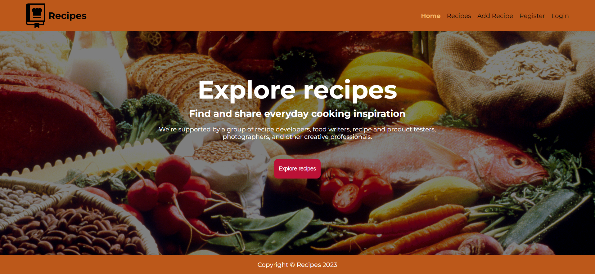

# Recipes - cooking app

**_Application for exploring and sharing food._**

Application allows to explore food, adding new ones, handle authenthication.

## Technology used

-   HTML
-   SCSS
-   Typescript
-   Angular
-   Firebase

## Usage

Download zip/clone repo and npm install & npm start.

## Preview
 

  

